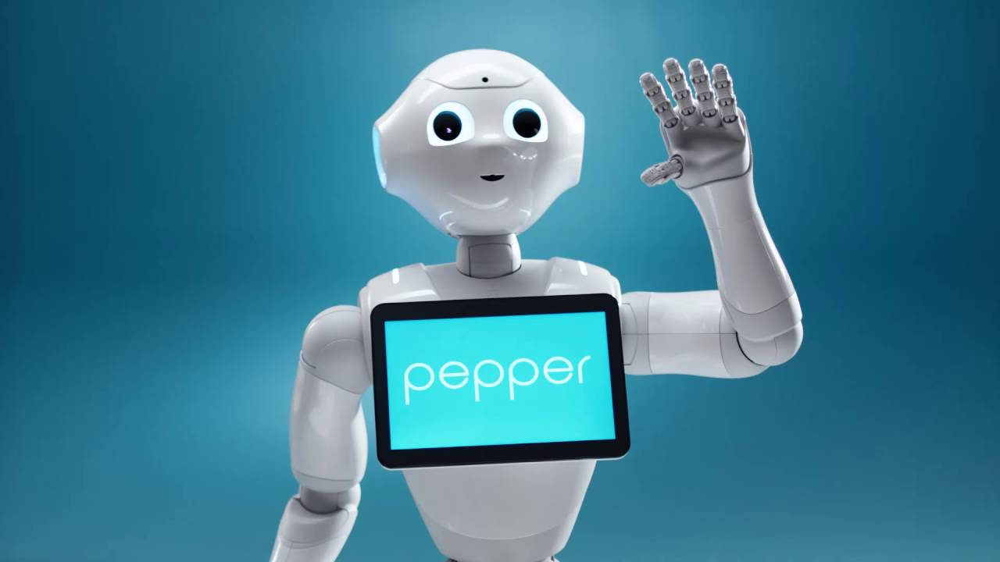

# Pepper as a Social Companion

**Leveraging LLMs, Face Recognition, and Emotional Intelligence for Context-Aware Interactions**  
*[Final Year Independent University Project]*

A lightweight Python client-sevrer platform enabling SoftBank Pepper to conduct personalised, context-aware conversations, with speech recognition, face detection, emotion detection and memory by bridging Pepper's Python 2.7 environment to modern AI tools running on Python 3.12.

---

## Abstract

This project investigates the development of Pepper the Robot's conversational capabilities through the integration of Large Language Models (LLMs), face recognition, contextual memory and emotion detection. Due to Pepper's reliance on outdated frameworks and limited AI support, a lightweight client-server architecture was developed to bridge Python 2.7 and Python 3.12 environments. Speech recognition, face detection and memory management are offloaded to an external server, while real-time interaction is handled directly on Pepper. The resulting system enables Pepper to conduct context-aware, personalised conversations, with emotion-sensitive response based on facial expression analysis. Iterative informal testing, complemented by participant studies, guided development and revealed user-experience improvements. Despite hardware constraints and some semantic limitations of the LLM, the project demonstrates the feasibility and promise of implementing AI with robotics for more natural human-robot interactions.

---

## Features

- **Audio Capture & Speech-to-Text:**
  - Continuous recording on Pepper, automatic concatenation of chunked recordings, silence-based cut off for processing, and transcription with Google's Speech Recognition.
- **Real-time Face Recognition:**
  - Streams frames to server, computes embeddings, queries Milvus for known faces and prompts for name registration when needed.
- **Emotion Detection:**
  - Uses Pepper's built-in PeoplePerception module to assign an emotional label to each user utterance for context.
- **Hybrid Memory System:**
  - **Short-Term Memory:** Keeps the last `x` exchanges per user in a local JSON file.
  - **Long-Term Memory:** Stores all past exchanges as embeddings in Milvus; retrieves top-k semantically similar pairs, excluding uncertain responses.
- **LED & Gesture Feedback:**
  - Visual indicators (face LEDs) and randomised animations to convey listening, thinking, speaking or confusion states.

